# PawFeed - UI/UX Case Study

## 1. Giới thiệu dự án

**PawFeed** là đồ án môn học **Thiết kế Giao diện và Trải nghiệm Người dùng**. Dự án được thực hiện nhằm thiết kế một nền tảng kết nối nguồn thức ăn thú cưng dư thừa với các trạm cứu hộ, mái ấm động vật và tình nguyện viên.

Ứng dụng hướng đến việc giảm lãng phí thực phẩm dành cho thú cưng, đồng thời hỗ trợ các trạm cứu hộ tiếp cận nguồn thức ăn miễn phí, minh bạch và thuận tiện hơn.

---

## 2. Vấn đề cần giải quyết

Tại các đô thị lớn, nhiều người nuôi thú cưng có thức ăn dư thừa do thú cưng đổi khẩu vị, mua quá nhiều hoặc thức ăn gần hạn sử dụng. Trong khi đó, các trạm cứu hộ động vật lại thường xuyên thiếu nguồn thức ăn ổn định.

Hiện nay, việc cho - nhận thức ăn chủ yếu diễn ra qua mạng xã hội như Facebook hoặc Zalo, dẫn đến nhiều khó khăn:

- Người cho không biết trạm cứu hộ ở đâu.
- Người nhận khó tìm nguồn thức ăn phù hợp và gần vị trí.
- Thông tin bài đăng nhanh bị trôi.
- Thiếu cơ chế xác thực người nhận.
- Khó kiểm tra chất lượng, hạn sử dụng và vị trí giao nhận.
- Quy trình liên hệ, hẹn giờ và giao nhận còn thủ công.

---

## 3. Mục tiêu thiết kế

- Thiết kế ứng dụng di động giúp kết nối người cho và người nhận thức ăn thú cưng dư thừa.
- Rút ngắn thời gian tìm kiếm người cho/người nhận từ vài ngày xuống còn vài phút.
- Tối ưu trải nghiệm đăng tải thức ăn, tìm kiếm thức ăn và gửi yêu cầu nhận.
- Tích hợp bản đồ tương tác để ưu tiên kết nối các điểm gần nhau.
- Tăng độ tin cậy thông qua hồ sơ xác thực, ảnh thực tế và thông tin hạn sử dụng.
- Tạo động lực đóng góp lâu dài bằng hệ thống huy hiệu và gamification.

---

## 4. Đối tượng người dùng

### Người cho - Giver

Là cá nhân hoặc hộ gia đình đang nuôi thú cưng, có thức ăn dư thừa nhưng vẫn còn chất lượng tốt. Họ muốn quyên góp thay vì vứt bỏ, nhưng thường thiếu thời gian, không biết trạm cứu hộ gần đó hoặc e ngại quy trình cho tặng phức tạp.

### Người nhận - Receiver

Là trạm cứu hộ, mái ấm động vật hoặc tình nguyện viên độc lập. Họ cần nguồn thức ăn miễn phí, minh bạch, có vị trí thuận tiện và có thông tin rõ ràng về loại thức ăn, số lượng, hạn sử dụng.

---

## 5. Phạm vi thiết kế

Trong giai đoạn MVP, PawFeed tập trung triển khai tại khu vực TP.HCM. Ứng dụng được thiết kế theo hướng mobile-first để tối ưu tính năng định vị GPS và hỗ trợ người dùng thao tác nhanh trên điện thoại.

Ứng dụng đóng vai trò là nền tảng kết nối thông tin. Việc giao nhận thực tế sẽ do người cho và người nhận tự thỏa thuận hoặc có thể tích hợp dịch vụ giao hàng bên thứ ba trong tương lai.

---

## 6. Quy trình thiết kế

### Bước 1: Nghiên cứu người dùng

- Khảo sát nhóm người cho.
- Khảo sát nhóm người nhận.
- Phân tích pain points.
- Xác định nhu cầu và động lực sử dụng ứng dụng.

### Bước 2: Xây dựng chân dung người dùng

- Persona người cho.
- Persona người nhận.
- User scenarios cho các tình huống sử dụng chính.

### Bước 3: Xây dựng User Journey Map

- Hành trình khi chưa có ứng dụng.
- Hành trình khi sử dụng PawFeed.
- Xác định điểm đau và cơ hội cải thiện trải nghiệm.

### Bước 4: Xây dựng User Flow

- Đăng ký / Đăng nhập.
- Đăng tải thức ăn.
- Tìm kiếm và gửi yêu cầu nhận.
- Duyệt yêu cầu.
- Nhận huy hiệu.
- Phát tín hiệu khẩn cấp từ trạm cứu hộ.

### Bước 5: Thiết kế Wireframe

- Wireframe mobile.
- Wireframe desktop.
- Bố cục các màn hình chính.

### Bước 6: Thiết kế giao diện chi tiết

- Logo.
- Bảng màu.
- Typography.
- Component library.
- Icon và minh họa.
- High-fidelity UI cho mobile và desktop.

### Bước 7: Prototype và kiểm thử

- Xây dựng prototype tương tác trên Figma.
- Kiểm thử người dùng.
- Ghi nhận lỗi trải nghiệm.
- Cải tiến thiết kế sau kiểm thử.

---

## 7. Tính năng chính

- Đăng nhập / Đăng ký tài khoản.
- Onboarding giới thiệu ứng dụng.
- Đăng tải thức ăn dư thừa.
- Tìm kiếm thức ăn theo loại, khoảng cách và trạng thái.
- Bản đồ tương tác hiển thị điểm cho tặng và trạm cứu hộ.
- Hồ sơ xác thực cho trạm cứu hộ.
- Gửi yêu cầu nhận thức ăn.
- Thông báo trạng thái yêu cầu.
- Hồ sơ cá nhân.
- Huy hiệu và thành tựu đóng góp.
- Tín hiệu khẩn cấp cho trạm cứu hộ.

---

## 8. Kết quả nghiên cứu nổi bật

- Nhóm người cho thường bỏ thức ăn dư vì không biết cho ai hoặc ngại mất thời gian tìm người nhận.
- Rào cản lớn của người cho là khoảng cách địa lý và thiếu thông tin trạm cứu hộ.
- Nhóm người nhận cần biết nhanh vị trí, hạn sử dụng và chất lượng thức ăn.
- Người dùng ủng hộ việc tích hợp bản đồ tương tác để tối ưu khoảng cách nhận đồ.
- Người dùng quan tâm đến cơ chế xác thực, hình ảnh thực tế và thông tin hạn sử dụng.
- Thiết kế cần ưu tiên card layout, bộ lọc nhanh, nút CTA nổi bật và giao diện thân thiện.

---

## 9. Một số màn hình thiết kế

### Logo và nhận diện thương hiệu

### Bảng màu

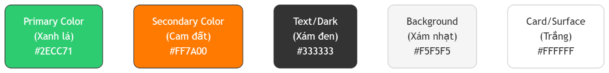

### Typography

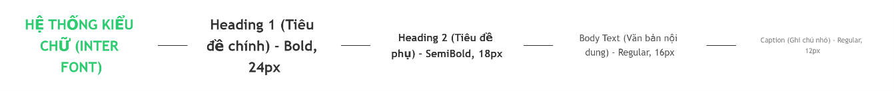

### Component Library

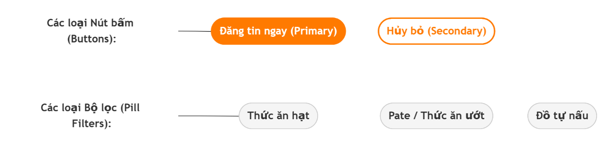

### Đăng nhập / Đăng ký

### Onboarding

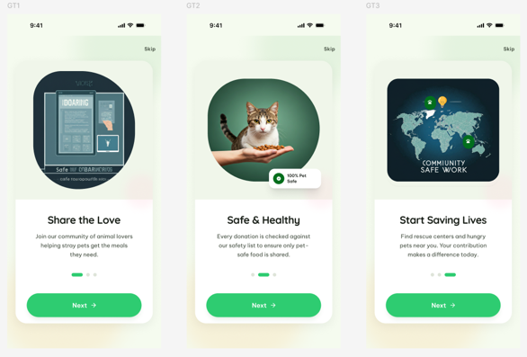

### Trang chủ và bộ lọc

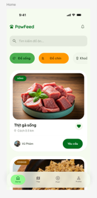

### Bản đồ tương tác

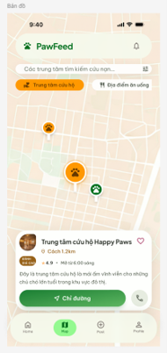

### Thông báo

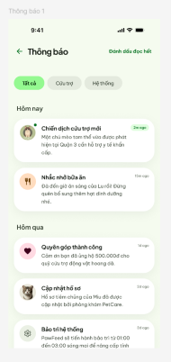

### Hồ sơ cá nhân

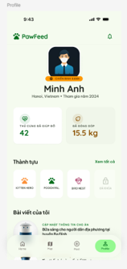

---

## 10. User Flow và Wireframe

### User Flow Đăng nhập

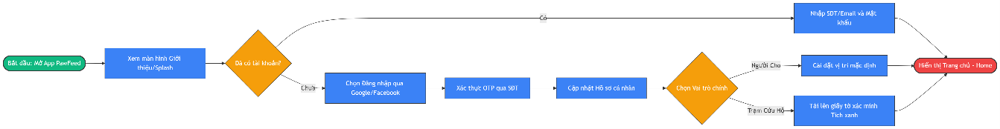

### User Flow Đăng tải thức ăn

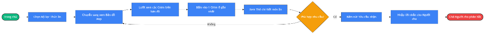

### User Flow Tìm kiếm và yêu cầu nhận

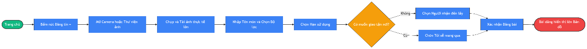

### Wireframe Mobile

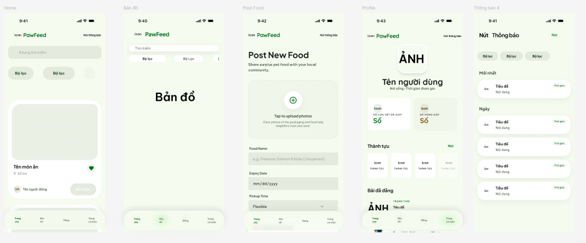

### Wireframe Desktop

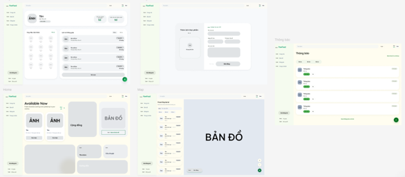

---

## 11. Prototype Figma

Figma Prototype:

[Thêm link Figma Prototype tại đây]

> Lưu ý: Link Figma cần được đặt quyền "Anyone with the link can view" để nhà tuyển dụng có thể mở và xem prototype.

---

## 12. Tài liệu dự án

- [Báo cáo UI/UX PawFeed](docs/BaoCao_UIUX_PawFeed.pdf)

---

## 13. Kết quả đạt được

- Hoàn thành quy trình nghiên cứu người dùng cho sản phẩm PawFeed.
- Xác định rõ pain points của người cho và người nhận.
- Xây dựng persona, user scenario và user journey map.
- Thiết kế user flow cho các tác vụ chính.
- Hoàn thiện wireframe mobile và desktop.
- Xây dựng style guide gồm logo, màu sắc, typography, component và icon.
- Thiết kế giao diện high-fidelity cho các màn hình chính.
- Xây dựng prototype tương tác trên Figma.
- Thực hiện kiểm thử người dùng và đề xuất cải tiến thiết kế.

---

## 14. Hướng phát triển

- Hoàn thiện đầy đủ các màn hình cho cả người cho và trạm cứu hộ.
- Bổ sung luồng xác thực trạm cứu hộ.
- Tích hợp dịch vụ giao hàng bên thứ ba.
- Phát triển tính năng SOS cho trạm cứu hộ cần hỗ trợ khẩn cấp.
- Bổ sung hệ thống đánh giá và phản hồi sau giao nhận.
- Phát triển thành ứng dụng mobile thực tế.

---

## 15. Ghi chú

Dự án được thực hiện với mục đích học tập trong môn Thiết kế Giao diện và Trải nghiệm Người dùng. Repository này dùng để trình bày năng lực nghiên cứu người dùng, thiết kế trải nghiệm, thiết kế giao diện, xây dựng prototype và kiểm thử người dùng.
